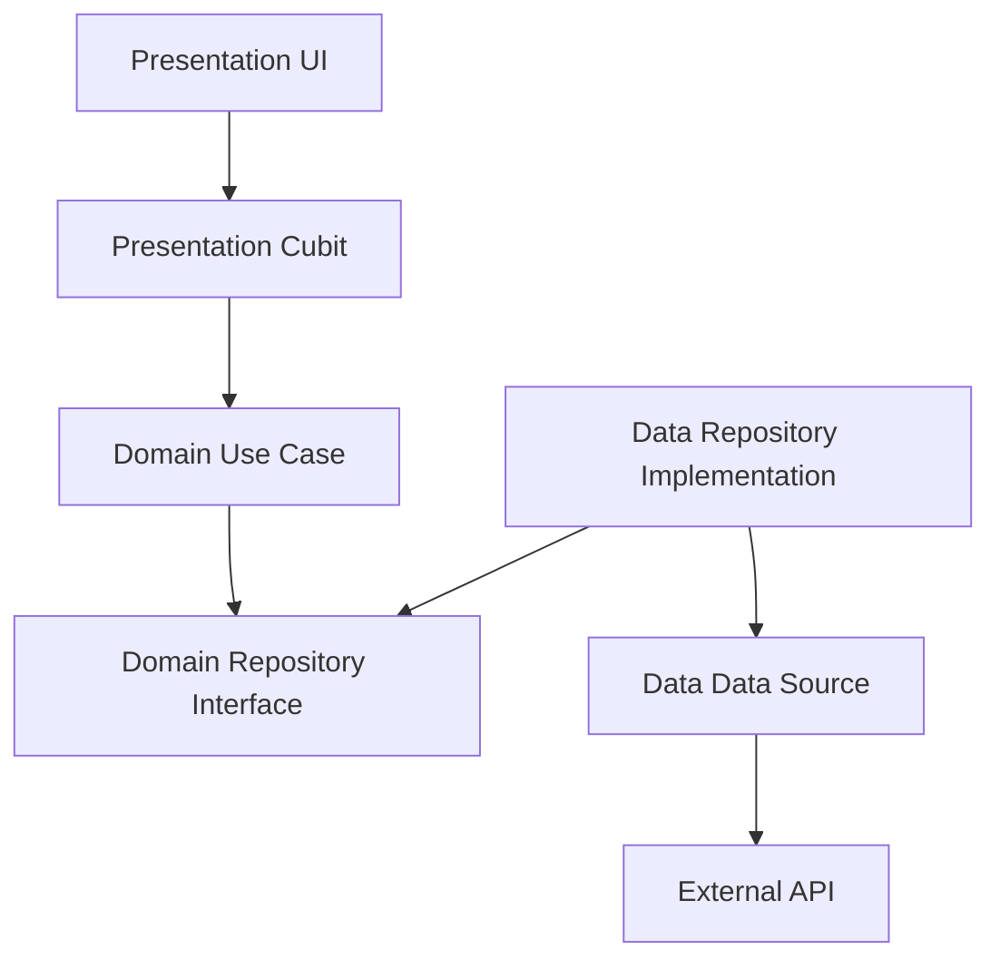

# Sellio Categories Sections

[](https://github.com/Ahmedsayed0895/Sellio-sections-controller/releases/latest)

A powerful and intuitive admin panel designed for managing Home Screen Category Sections in the Sellio application. This tool empowers administrators to organize, prioritize, and manage the visibility of product categories with a seamless and responsive user interface.

## Key Features

*   **Section Management**: Create, Read, Update, and Delete (CRUD) sections with ease.
*   **Subcategory Images**: Visual support for category images, making identification easier.
*   **Optimistic UI Updates**: Instant feedback on actions (like toggling active status or reordering) ensures a snappy user experience, with automatic rollback in case of server errors.
*   **Smart Merging**: Intelligently merges server data with local state to ensure inactive sections remain visible and editable for administrators.
*   **Sorting & Organization**: Manually control the display order of sections via a sort order field.
*   **Active/Inactive Toggling**: Quickly enable or disable sections from the main list.
*   **Error Handling**: Comprehensive error handling with user-friendly snackbars and retry mechanisms.

## Architecture

This project follows **Clean Architecture** principles to ensure scalability, testability, and separation of concerns.



- **Domain Layer**: Contains Entities, Use Case, and Repository Interfaces. Pure Dart, no dependencies.
- **Data Layer**: Implements Repositories, defines Models, and handles Data Sources (API/DB).
- **Presentation Layer**: UI (Screens) and State Management (Cubits).

> [!NOTE]
> For a deep dive into the architecture, check out [Clean Architecture in Sellio](docs/clean_architecture.md).

## Technology Stack

*   **Framework**: [Flutter](https://flutter.dev/) (Dart 3.x)
*   **State Management**: [flutter_bloc](https://pub.dev/packages/flutter_bloc) (Cubit) for predictable state.
*   **Dependency Injection**: [GetIt](https://pub.dev/packages/get_it) & [Injectable](https://pub.dev/packages/injectable) for decoupled architecture.
*   **Networking**: [Retrofit](https://pub.dev/packages/retrofit) & [Dio](https://pub.dev/packages/dio) for type-safe API calls.
*   **Serialization**: [json_serializable](https://pub.dev/packages/json_serializable) for automated JSON handling.
*   **Code Generation**: [build_runner](https://pub.dev/packages/build_runner) for generating boilerplate.

> [!TIP]
> Learn more about our networking layer in [Retrofit Details](docs/retrofit_details.md).

## Getting Started

### Prerequisites

*   [Flutter SDK](https://docs.flutter.dev/get-started/install)
*   Dart SDK

### Installation

1.  **Clone the repository**
    ```bash
    git clone https://github.com/Ahmedsayed0895/Sellio-sections-controller.git
    ```

2.  **Install dependencies**
    ```bash
    flutter pub get
    ```

3.  **Generate Code** (required for Retrofit, Models, & DI)
    ```bash
    flutter pub run build_runner build --delete-conflicting-outputs
    ```

4.  **Run the application**
    ```bash
    flutter run
    ```

## Project Structure

```
lib/
├── domain/           # Business logic (Entities, Use Cases, Repos)
├── data/             # Data implementation (Models, APIs, Repos Impl)
├── presentation/     # UI and Cubits
│   ├── screens/
│   ├── cubits/
│   └── theme/
└── main.dart         # Entry point
```

## Documentation

- [Cubit Refactor Guide](docs/cubit_refactor_guide.md)
- [Clean Architecture Guide](docs/clean_architecture.md)
- [Retrofit & Networking](docs/retrofit_details.md)
- [Dependency Injection Guide](docs/dependency_injection.md)
- [Release Automation](docs/release_automation_guide.md)
- [Atomic Commits Guide](docs/atomic_commits_guide.md)