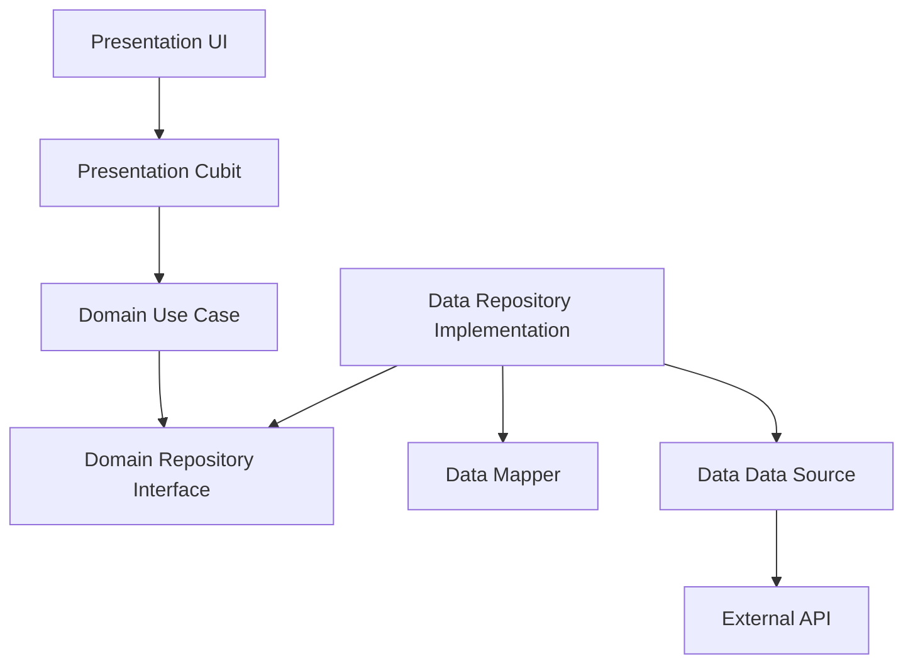

# Sellio Categories Sections

[](https://github.com/Ahmedsayed0895/Sellio-sections-controller/releases/latest)

A powerful admin panel for managing Home Screen Category Sections in the Sellio application — built with **Clean Architecture**, **Cubit**, and **Retrofit**, and fully documented as a **learning resource** for Flutter developers.

---

##  Learn Clean Architecture — Chapter by Chapter

> **This project is not just an app — it's a guided course.**
>
> Every architectural decision, every layer, every line of code is explained in a beginner-friendly **App Story** that walks you through building a real-world Flutter app using Clean Architecture.

| #   | Chapter                                                                 | What You'll Learn                                |
| --- | ----------------------------------------------------------------------- | ------------------------------------------------ |
| 0   | [Introduction](app_story/00_introduction.md)                            | Project overview and architecture map            |
| 1   | [The Foundation — Entities](app_story/01_the_foundation.md)             | Domain entities and business objects             |
| 2   | [The Translator — Models & JSON](app_story/02_the_translator.md)        | Data models, JSON serialization, code generation |
| 3   | [The Messenger — API & Data Sources](app_story/03_the_messenger.md)     | Retrofit, Dio, and remote data sources           |
| 3.5 | [The Bridge — Mappers](app_story/03b_the_bridge.md)                     | Decoupling models from entities with mappers     |
| 4   | [The Rulebook — Repositories & Use Cases](app_story/04_the_rulebook.md) | Repository pattern and single-purpose use cases  |
| 5   | [The Wiring — Dependency Injection](app_story/05_the_wiring.md)         | GetIt, Injectable, and auto-wiring               |
| 6   | [The Brain — Cubit State Management](app_story/06_the_brain.md)         | Cubit, states, and reactive UI                   |
| 7   | [The Face — UI Layer](app_story/07_the_face.md)                         | Screens, components, and user interactions       |

### Technical Deep Dives

| Guide                                                  | Description                                       |
| ------------------------------------------------------ | ------------------------------------------------- |
| [Clean Architecture](docs/clean_architecture.md)       | Layer separation, dependency rules, and diagrams  |
| [Dependency Injection](docs/dependency_injection.md)   | How GetIt and Injectable wire everything together |
| [Retrofit & Networking](docs/retrofit_details.md)      | Type-safe API calls with Retrofit and Dio         |
| [Cubit Refactor Guide](docs/cubit_refactor_guide.md)   | Migrating from ViewModel to Cubit                 |
| [Release Automation](docs/release_automation_guide.md) | CI/CD with GitHub Actions                         |

---

## Key Features

*   **Section Management**: Full CRUD operations for home screen sections
*   **Shimmer Loading**: Polished skeleton loading effect instead of spinners
*   **Optimistic UI**: Instant feedback with automatic rollback on errors
*   **Smart Merging**: Server data merged with local state to preserve inactive sections
*   **Active/Inactive Toggling**: Quick enable/disable from the main list
*   **Sort Order Sync**: Edit sort order and see changes reflected immediately

## Architecture

This project follows **Clean Architecture** principles with complete layer separation:



- **Domain Layer**: Entities, Use Cases, Repository Interfaces — pure Dart, zero dependencies
- **Data Layer**: Models, Mappers, Data Sources, Repository Implementations
- **Presentation Layer**: Screens, Components, Cubits, Theme

## Technology Stack

*   **Framework**: [Flutter](https://flutter.dev/) (Dart 3.x)
*   **State Management**: [flutter_bloc](https://pub.dev/packages/flutter_bloc) (Cubit)
*   **Dependency Injection**: [GetIt](https://pub.dev/packages/get_it) & [Injectable](https://pub.dev/packages/injectable)
*   **Networking**: [Retrofit](https://pub.dev/packages/retrofit) & [Dio](https://pub.dev/packages/dio)
*   **Serialization**: [json_serializable](https://pub.dev/packages/json_serializable)
*   **Loading Effects**: [shimmer](https://pub.dev/packages/shimmer)

## Getting Started

### Prerequisites

*   [Flutter SDK](https://docs.flutter.dev/get-started/install)
*   Dart SDK

### Installation

1.  **Clone the repository**
    ```bash
    git clone https://github.com/Ahmedsayed0895/Sellio-sections-controller.git
    ```

2.  **Install dependencies**
    ```bash
    flutter pub get
    ```

3.  **Generate Code** (required for Retrofit, Models, & DI)
    ```bash
    flutter pub run build_runner build --delete-conflicting-outputs
    ```

4.  **Run the application**
    ```bash
    flutter run
    ```

## Project Structure

```
lib/
├── domain/           # Business logic (Entities, Use Cases, Repos)
├── data/             # Data implementation (Models, Mappers, APIs, Repos Impl)
│   ├── models/
│   ├── mappers/
│   ├── datasources/
│   └── repositories/
├── presentation/     # UI and Cubits
│   ├── screens/
│   ├── cubits/
│   └── theme/
└── main.dart         # Entry point

app_story/            #  Chapter-by-chapter architecture guide
docs/                 #  Technical deep-dive documentation
```
