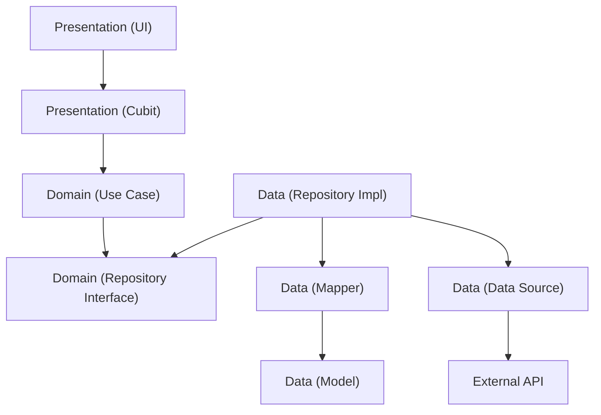

# Clean Architecture in Sellio Categories Sections

This project follows the principles of **Clean Architecture** to ensure separation of concerns, scalability, and testability. The code is organized into three main layers: **Domain**, **Data**, and **Presentation**.

## 1. Domain Layer (`lib/domain`)
The core of the application logic. It is independent of any external libraries (like Flutter, Dio, or database implementations).

### Components:
- **Entities** (`lib/domain/entities`): Pure Dart classes representing the core business objects.
    - Example: `CategorySection`, `Category`.
- **Repositories (Interfaces)** (`lib/domain/repositories`): Abstract classes defining the contract for data operations.
    - Example: `ISectionRepository`, `ICategoryRepository`.
- **Use Cases** (`lib/domain/usecases`): Classes that encapsulate specific business logic. They interact with repositories to fulfill a single task.
    - Example: `GetSections`, `CreateSection`, `UpdateSection`.

## 2. Data Layer (`lib/data`)
Responsible for data retrieval and storage. It implements the interfaces defined in the Domain layer.

### Components:
- **Models** (`lib/data/models`): Standalone data transfer objects (DTOs) used for API communication. They handle JSON serialization/deserialization and are fully independent of Entities.
    - Example: `SectionModel`, `CategoryModel`.
- **Mappers** (`lib/data/mappers`): Bridge classes that convert between Models (data layer) and Entities (domain layer). This keeps both layers independent.
    - Example: `SectionMapper`, `CategoryMapper`.
- **Data Sources** (`lib/data/datasources`): Handle the actual data fetching (API calls, local database).
    - **RemoteDataSource**: Defined by an interface (`IRemoteDataSource`) and implementation (`RemoteDataSourceImpl`) that uses **Retrofit** (`SellioApi`) to make network requests.
- **Repositories (Implementations)** (`lib/data/repositories`): Concrete implementations of the Domain repositories. They use Mappers to convert Models to Entities before returning data to the Domain layer.
    - Example: `SectionRepositoryImpl`, `CategoryRepositoryImpl`.

## 3. Presentation Layer (`lib/presentation`)
Responsible for the UI and user interaction.

### Components:
- **Cubits** (`lib/presentation/cubits`): Manage the state of the UI using the BLoC pattern (Cubit variant). They call Use Cases and emit state changes.
    - Example: `AdminPanelCubit`, `AdminPanelState`.
- **UI** (`lib/presentation/screens`): Flutter widgets that display data and react to user input. They observe the Cubits via `BlocBuilder`/`BlocConsumer`.
    - Example: `AdminPanel`.
- **Theme** (`lib/presentation/theme`): Centralized color and style definitions.
    - Example: `AppColors`.

## Dependency Flow
The dependency rule is strictly followed: **Source code dependencies only point inwards.**
- **Presentation** depends on **Domain**.
- **Data** depends on **Domain**.
- **Domain** depends on **Nothing**.

